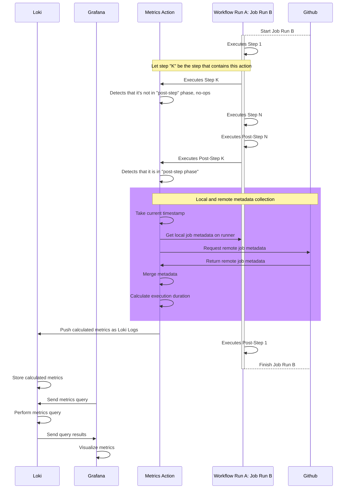
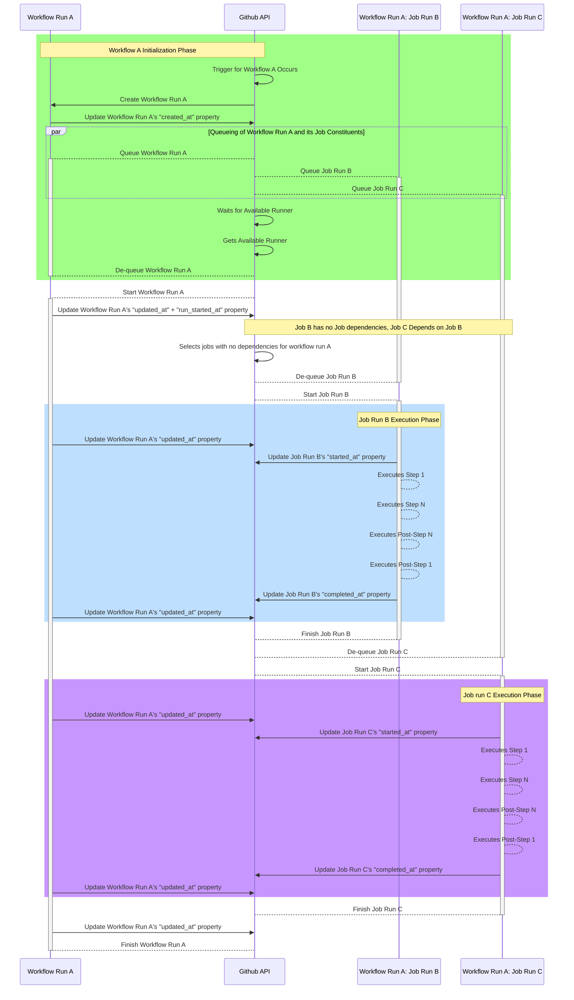

# push-gha-metrics-action

# Table of Contents

- [About](#about)
- [Usage](#usage)
- [Development](#development)
  - [Requirements](#requirements)
  - [First Time Setup](#first-time-setup)
  - [Setup After Pulling Changes](#setup-after-pulling-changes)
- [Tests](#tests)
  - [Running Tests](#running-tests)
    - [Unit Tests](#unit-tests)
    - [Integration Tests](#integration-tests)
      - [Setup](#setup)
      - [Execution](#execution)
      - [Teardown](#teardown)
  - [Maintaining Fixtures](#maintaining-fixtures)
    - [Generating "github" fixtures](#generating-github-fixtures)
    - [Generating "context" fixtures](#generating-context-fixtures)
    - [Generating "workflows" fixtures](#generating-workflows-fixtures)
- [Considerations](#considerations)
  - [Common Pitfalls](#common-pitfalls)
    - [Security Concerns](#security-concerns)
    - [Metrics Storage/Processing/Querying Scaling](#metrics-storageprocessingquerying-scaling)
    - [Metrics Collection Scaling](#metrics-collection-scaling)
    - [Metrics Collection Maintenance](#metrics-collection-maintenance)
    - [Incompatible Technologies Used](#incompatible-technologies-used)
  - [Projects Considered](#projects-considered)
- [Notes](#notes)
  - [Lifecycle of a Workflow Run](#lifecycle-of-a-workflow-run)
  - [Job Name vs Job Id](#job-name-vs-job-id)
    - [Matrices](#matrices)

# About

Github actions' insights for github actions is lacking in easily actionable
information that someone would want if they are looking to optimize their CI/CD
pipelines. The following questions are difficult to answer at a glance using the
tools that Github UI provides you, whereas the goal of this action is to
gradually answer them, starting with the highest impact ones first.

| Question                                               | Over Time               | Over Commits, Pull Requests, Releases, Etc | Within A Repository     | Across All Repositories in an Organization |
| ------------------------------------------------------ | ----------------------- | ------------------------------------------ | ----------------------- | ------------------------------------------ |
| Which workflows are taking up the most time?           | :heavy_check_mark:      | :heavy_check_mark:                         | :heavy_check_mark:      | :heavy_check_mark:                         |
| Which job takes up the most time?                      | :heavy_check_mark:      | :heavy_check_mark:                         | :heavy_check_mark:      | :heavy_check_mark:                         |
| Which repository is responsible for the most run time? | :heavy_check_mark:      | :heavy_check_mark:                         | :heavy_check_mark:      | :heavy_check_mark:                         |
| How often does a workflow fail?                        | :x:                     | :x:                                        | :x:                     | :x:                                        |
| How often does a job fail?                             | :x:                     | :x:                                        | :x:                     | :x:                                        |
| How long is a job queued for?                          | :building_construction: | :building_construction:                    | :building_construction: | :building_construction:                    |
| How long is a workflow queued for?                     | :building_construction: | :building_construction:                    | :building_construction: | :building_construction:                    |
| How many jobs are currently being executed?            | :building_construction: | :building_construction:                    | :building_construction: | :building_construction:                    |

We want to answer these questions so we are able to identify bottlenecks in
developer productivity and prioritize them using quantitative analysis.

This action creates logs that contain information about the currently executing
github action's job, then pushes them to a Loki endpoint for metrics processing.
From there, we visualize these metrics within Grafana. This enables us to answer
the aforementioned questions.



# Usage

You should have this action being used as the **first** step in every single job
of each workflow you'd like to collect metrics about. **Every job name in your
workflow must be unique**, see `Job Name vs Id` and `Matrices` in the `Notes`
section.

See the [action.yml](action.yml) file for information on inputs that this action
accepts.

You can use the included workflow updater script to help you update all of the
workflows within a directory.

```sh
# Install dependencies
pnpm install

# TAG is the tag you'd like to use for this github action, like a git full sha "c5625349606d56efb97da92eeb155b20370cefbf" or a tag "v1"
# INCLUDE_NEW_LINE should be set if you want this script to append a new line after inserting this action as a step, leave unset to not inject any newlines

TAG=c5625349606d56efb97da92eeb155b20370cefbf pnpm update-workflows ~/src/smartcontractkit/chainlink/.github/workflows
```

# Development

## Requirements

- docker-compose ^1.25.0
- asdf v0.9.0
- pnpm ^6.32.3

## First Time Setup

```sh
# Install nodejs
asdf plugin add nodejs
asdf install

# Install pnpm
npm install -g pnpm

# Install repo deps
pnpm i
```

After performing first time setup, you should proceed to the testing section to
run both the unit and integration tests.

## Setup After Pulling Changes

After pulling new changes, you should make a habit of reinstalling dependencies.

```sh
pnpm i
```

# Tests

## Running Tests

### Unit Tests

```sh
pnpm test -- unit
```

### Integration Tests

A fully automated workflow for running integration tests hasn't been done yet.
There's a handful of manual steps that need to be performed to run our current
suite of integration tests.

#### Setup

Setup our compose stack, which consists of Grafana and Loki instances.

```sh
docker-compose up
```

#### Execution

Run our integration tests.

```sh
pnpm test -- integration
```

#### Teardown

Teardown our compose stack, and remove any persisted data stored in volumes.

```sh
docker-compose down -v
```

## Maintaining Fixtures

Fixture generation isn't fully automated yet, so there's a couple pitfalls to be
aware of when attempting to update fixtures with newer data. Currently, there's
3 different directories of fixtures, `github`, `context`, and `workflows`.

### Generating "github" fixtures

The "github" fixtures are used to mock responses from the Github API and context
on the current github runner.

The fixtures used in the "github" folder are generated by CI itself, then
uploaded as an artifact. If you take a look at the
[fixtures](.github/workflows/generate-fixtures.yml) file, you'll see a job
called `generate-fixtures`. The job collects API and context data about the
currently running job, then packages it into an artifact for a maintainer to
download and extract.

The maintainer process for updating fixtures is as follows:

- Find or create a commit that the `generate-fixtures` job of the
  `Push Metrics Fixture Generation` workflow has/will run on, then navigate to
  its run page. Note that artifacts are only available for the latest run of a
  workflow. If you need to create fixtures based on multiple runs of a workflow,
  you'll need to perform these steps sequentially per workflow run you'd like to
  capture fixtures for.
- Locate the `run-id` of the workflow run you'd like to snag the artifact for.
- Download the artifact locally using the interactive `gh` command
  `gh run download <run-id>`
- This will download the fixtures locally within the repo, from here, you'll
  want to move them to the desired directory and create a barrel `index.ts` file
  that imports the JSON files.

### Generating "context" fixtures

Context fixtures are generated by the `context.test.ts` unit test when the
`UPDATE_CONTEXT_FIXTURE` environment variable has been set. It's not ideal,
since we're now tightly bound to a successful run of a unit test for executing
the rest of its dependents. In future work, fixture generation needs to be
independent of test execution.

```sh
UPDATE_CONTEXT_FIXTURE=true pnpm test context
```

### Generating "workflows" fixtures

The workflows that are inside the `workflows` fixture directory are real ones
grabbed from our public repositories. See
[the fixture generation script](test/fixtures/workflows/script.fish) for
inspiration on the automation of pulling workflows in from other repositories.

# Considerations

## Common Pitfalls

Most of the following considerations were not used due to certain architectural
decisions made which would cause friction either due to:

### Security Concerns

- Requiring PAT tokens for monitoring a repository
- For multi-repository monitoring over an org, requiring a PAT token with org
  level access

### Metrics Storage/Processing/Querying Scaling

- Creating labels with unbounded cardinality, which can cause severe degradation
  of the metrics processing service

### Metrics Collection Scaling

- Collecting metrics by mass querying the Github HTTP API, or large queries
  against Github's GraphQL api, both resulting in rate limiting
- Collecting workflow + job metrics by having metrics collection done by a
  workflow that triggered from other workflows being completed. This results in
  doubling the amount of jobs being executed in a repository, making it very
  expensive.

### Metrics Collection Maintenance

- Collecting workflow + job metrics by having a standalone service, this results
  in having to maintain a long-lived service along with protecting any secrets
  it needs to access Github's API.

### Incompatible Technologies Used

- Metrics collection / querying / vis revolving around a tech stack that isn't
  Prometheus / Loki / Grafana. Adopting another tech would make the user
  experience loaded with friction rather than using what we already have.

## Projects Considered

- https://github.com/tchelovilar/github-org-runner-exporter
- https://github.com/transferwise/github-actions-api-exporter
- https://github.com/Spendesk/github-actions-exporter
- https://github.com/marketplace/actions/datadog-actions-metrics
- https://github.com/kaidotdev/github-actions-exporter
- https://github.com/cpanato/github_actions_exporter
- https://docs.datadoghq.com/continuous_integration/setup_pipelines/github/

# Notes

## Lifecycle of a Workflow Run

Given the following workflow, a simplified sequence diagram is provided that
shows us at what points github is updated with various timestamps. With these
timestamps we can calculate useful durations as metrics.

```yaml
name: A
on:
  workflow_dispatch:
  push:
  pull_request:

jobs:
  B:
    runs-on: ubuntu-18.04
    steps:
      - uses: actions/checkout@v3

      - uses: ./.github/actions/push-metrics/
        with:
          basic-auth: ${{ secrets.GRAFANA_CLOUD_BASIC_AUTH }}
          hostname: ${{ secrets.GRAFANA_CLOUD_HOST }}
          this-job-name: B

      - run: echo "test test test"

  C:
    needs: [B]
    runs-on: ubuntu-18.04
    steps:
      - uses: actions/checkout@v3

      - uses: ./.github/actions/push-metrics/
        with:
          basic-auth: ${{ secrets.GRAFANA_CLOUD_BASIC_AUTH }}
          hostname: ${{ secrets.GRAFANA_CLOUD_HOST }}
          this-job-name: C

      - run: echo "test test test"
```



## Job Name vs Job Id

We gather additional context on the currently running job by querying the
[List Jobs for a Workflow Run Attempt endpoint](https://docs.github.com/en/rest/actions/workflow-jobs#list-jobs-for-a-workflow-run-attempt),
then filtering the returned jobs by their job name to find the currently
executing one.

Unfortunately, the github runner only reports the
[job id](https://github.com/actions/runner/issues/852), not the `job name` that
we need to find our job by. If you have a `job[job_id].name` specified, you
_must_ specify the `this-job-name` parameter to this action, see the below
**Matrices** section for more info. **Also**, you must **not** specify the same
job name for two different job id's, otherwise the same situation will occur:
the metrics collection action will fail to properly resolve the correct job.

### Matrices

The name of the current job being executed given by the current runner context
does not align with the name of the job reported by the API. Even when names of
the job are unique from dynamic job names, there is a discrepancy.

This is due to the Github runner reporting the currently executing job by its
`key` within the workflow file, while the Github API reports the currently
executing job by its `name` value, with the `key` value being the fallback if
the `name` isn't defined.

What this means is that this action cannot discover its own job state from the
given context, if the job being executed is part of a matrix. An input value
that gives the proper job name to lookup by is needed during matrix execution.

```yaml
jobs:
  my-parallel-job:
    # This generates a unique name within the matrix itself. Now we need to pass this value to this action so it can do a successful lookup
    name: my-unique-name-${{ matrix.key1 }}
    runs-on: ubuntu-latest
    strategy:
      matrix:
        key1: ["unique", "values"]
    steps:
      - uses: push-metrics
        with:
          # Now we use the same name here, so our metrics collection works properly
          this-job-name: my-unique-name-${{ matrix.key1 }}
```

For more information, see: https://github.com/actions/runner/issues/852
